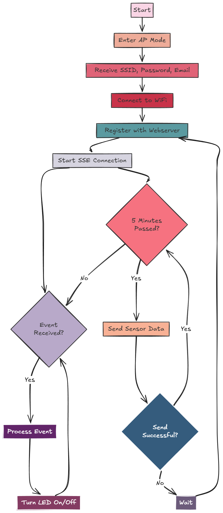

# 🌿 Mali: Gardening Automation System

Welcome to the **Gardening Automation System**! This project helps you monitor and control the conditions in your garden with an **ESP32** microcontroller and a **FastAPI** backend. Keep track of temperature, humidity, and automate watering to ensure your plants are always well cared for. 🌱💧

---

## 📦 Table of Contents

1. [Introduction](#-introduction)
2. [Features](#-features)
3. [Installation](#-installation)
4. [Project Structure](#-project-structure)
5. [API Documentation](#-api-documentation)
6. [Usage](#-usage)
7. [Contributing](#-contributing)
8. [License](#-license)

---

## 🧑‍🌾 Introduction

This project aims to create a smart gardening solution using an **ESP32** microcontroller and a backend built with **FastAPI**. With this system, you can:

- Monitor garden conditions, including **temperature** and **humidity** using a **DHT11** sensor.
- Control a **water pump** to automatically water your plants based on set parameters.
- Access the data via a simple RESTful API built with **FastAPI** for easy integration.

Perfect for automating your gardening routine!

---

## ⚙️ Features

- **Real-time Monitoring**: Get live readings of the temperature and humidity of your garden.
- **Automated Watering**: Control a water pump to water your plants based on conditions or schedules.
- **Web Interface**: Access garden data via a FastAPI-powered web API.
- **ESP32 Integration**: Seamlessly integrates with the ESP32 for reliable communication with sensors and devices.
- **Easy to Use**: The system is designed to be user-friendly with minimal setup.

---

## 📥 Installation

### Requirements

- **ESP32 microcontroller**
- **DHT11 sensor** for temperature and humidity monitoring
- **Water pump** for plant watering
- Python 3.8+
- **FastAPI** for the web API
- **Uvicorn** for running the FastAPI server
- **PlatformIO** or Arduino IDE for ESP32 programming

---

## 🧱 Project Structure

```gardening-automation/
│
├── esp/                         # ESP32 firmware and related code
│   └── garden_code.ino          # Main code for the ESP32
├── backend/                     # FastAPI backend
│   ├── app/
|   |   ├── templates            # Html templates for frontend
|   |   ├── api.py
|   |   └── requirements.txt     # Python dependencies
│   └── main                     # Server run wrapper
└── README.md                    # This README file
```
## Current Flow Diagram


